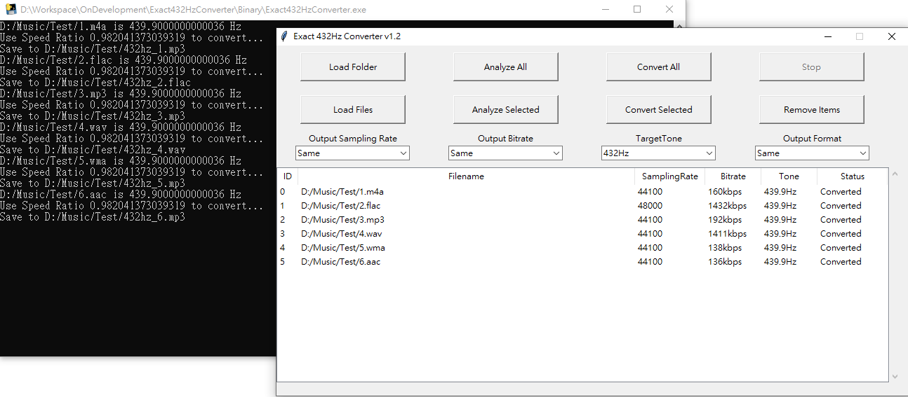

# Exact 432Hz Converter
## Python Version
### Introduction
- This program using FFT to extract the frequency band of audio files then calculate exact tone of audio files.

- Convert function provide exact 432Hz converter that convert all audio files into 432Hz (most is 440Hz to 432Hz)

### Environment
- conda create --name 432Hz python=3.7

- pip install numpy

- pip install pydub

- conda install ffmpeg

### Execution
- python Exact432HzConverter.py

- Analyze is to calculate the Tone of files

- Convert is for converting the files into 432Hz Tone with filename: 432hz_Filename

### File Format
- Supported Input: .m4a, .flac, .mp3, .wav, .wma, .aac 

- Supported Output: .flac, .mp3, .wav

- It will convert to .mp3 if Input is .m4a, .wma, .aac and OutputFormat set to Same

### Algorithm Description:
 1.Doing FFT on front 100 seconds of PCM RAW data.
 2.Loop Freq from 424Hz to 448Hz, step 0.1Hz.
 2a. Shift 440Hz tone frequency table to each Freq,
 2b. Find the location of each tone frequency table’s location of FFT data.
 2c. Calculate the sum of each location in FFT data.
 3. Find the max sum of each Freq.
 4. Output final maxFreq which is the current Tone frequency.
